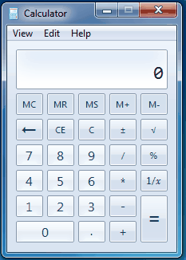
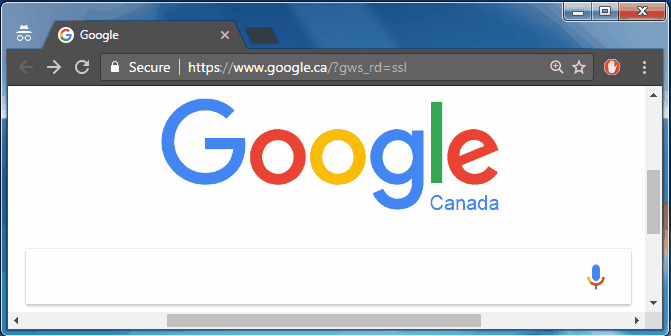
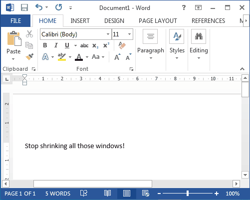
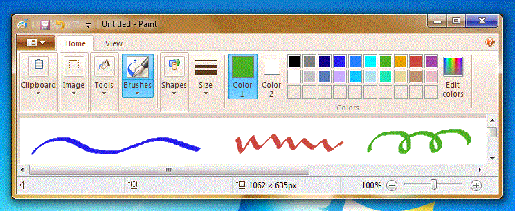
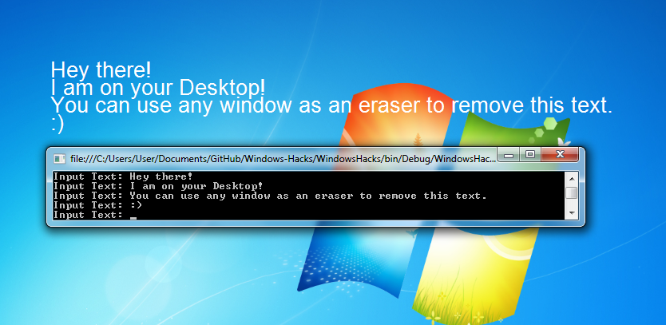
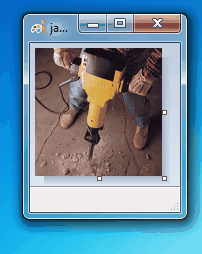
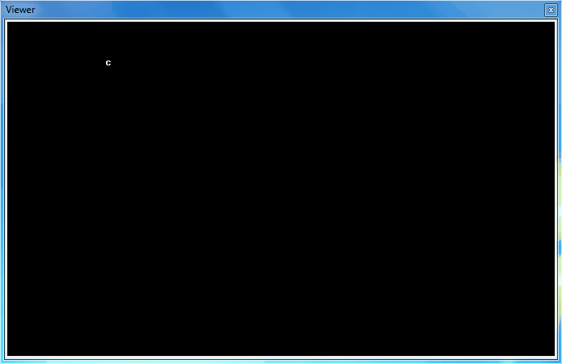
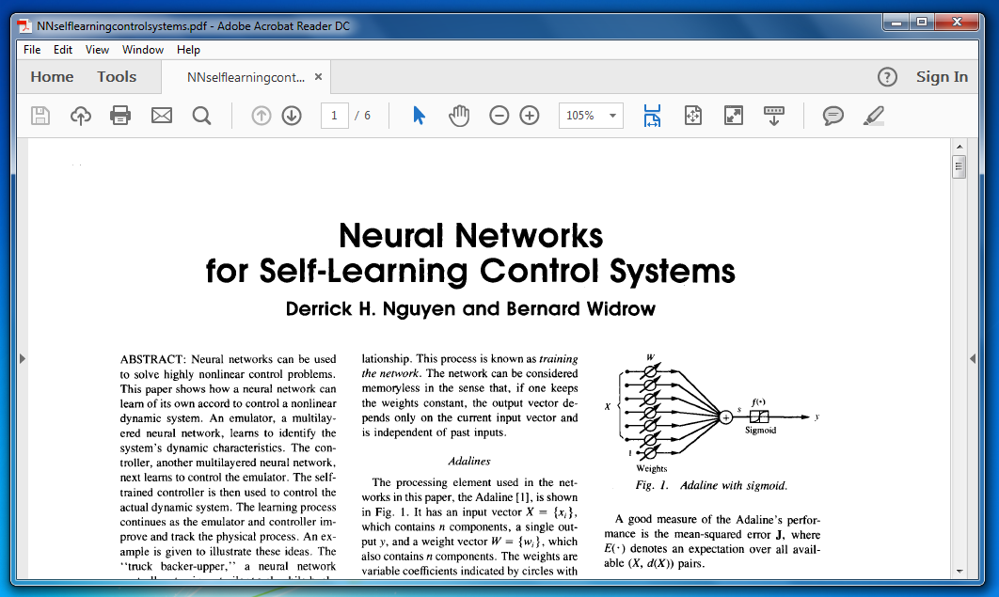
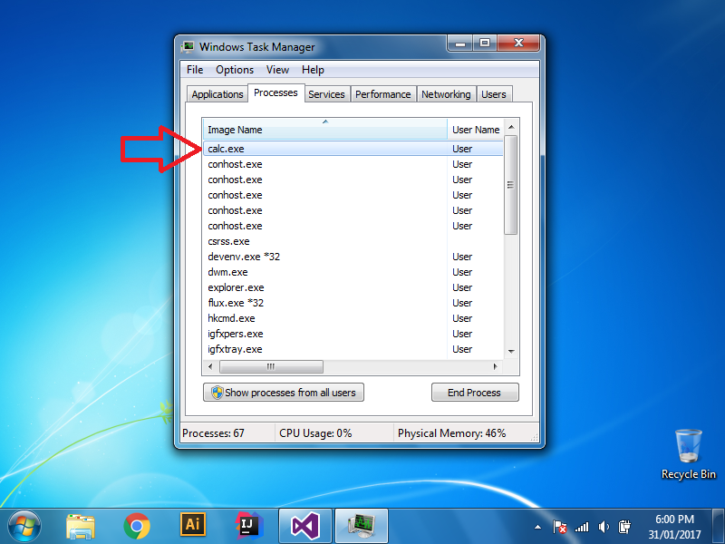
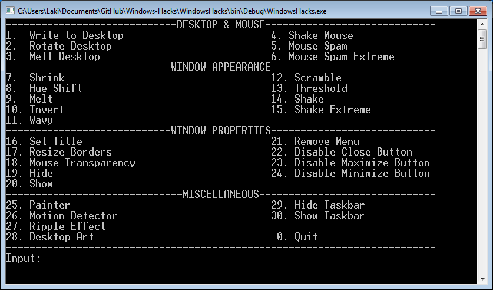

# Windows-Hacks
Creative and unusual things that can be done with the Windows API.

## Shrinking Windows
Any window can be shrunk down.

Shrinking the Calculator:

Shrinking Google Chrome:

Even Microsoft Word is not safe from being shrunk:

## Hue Shifter

Any window can be selected to have its colors shifted. 

Hue shifting Microsoft Paint:

Hue shifting Microsoft Word:

## Writing Directly To The Desktop

## Desktop Rotation

Zooms into the Desktop and then spins it around and around.

## Window Shaker

Randomly shakes the specified window without the use of a mouse.

Here you can see Microsoft Paint shaking all by itself. Pretty spooky huh?

If you are a masterful artist (such as myself), you may find that it is too easy to draw in a stationary canvas. In that case, this is the perfect utility for you.

## Wavy Window

## Motion Detection

Detects motion in the specified window. This was a lot of fun to play with, especially when used on videos but I can only include so many gifs...

Detecting motion in Microsoft Paint:

Detecting motion in command prompt:

## Automated Painting

Automatically draws a thresholded Mona Lisa into Microsoft Paint:

## Window Scrambler

## Window Thresholding

This makes the light colors transparent and the dark colors black.

Before thresholding:

After thresholding:

## Force Changing Window Properties

Many of the properties of a Window can be force changed. In the image below I have changed the following properties in the Windows Calculator:
 - Disabled the close, maximimize and minimize buttons
 - Removed the drop down menu (View, Edit, Help)
 - Changed the width and height of the Window borders
 - Changed the title
 

 
## Mouse Spam

Spawns hundreds of mice, where each one moves independently across the screen.

## Hiding a Window

Any Window can be hidden. In the following image I have hidden the Windows Calculator. As you can see, it is no where to be found on the Desktop. But if you open the Windows Task Manager it is actually still running in the background:

## More...

Here is the menu. It lists all of the features:

## Notes

 - The main class that brings all of the functions together is *Program.cs*.

 - The to do list can be found in the top directory. This includes bugs to fix and new features to implement.

 - The External folder contains two essential .dll files that must be referenced for the code to work. These two files are WindowsAPI.dll and and ImageProcessing.dll and the code for these can be seen in my [WinAPI-Wrapper](https://github.com/LazoCoder/WinAPI-Wrapper) and [Image-Processing-Library](https://github.com/LazoCoder/Image-Processing-Library) repositories respectively. 

 - This has only been tested on Windows 7.
